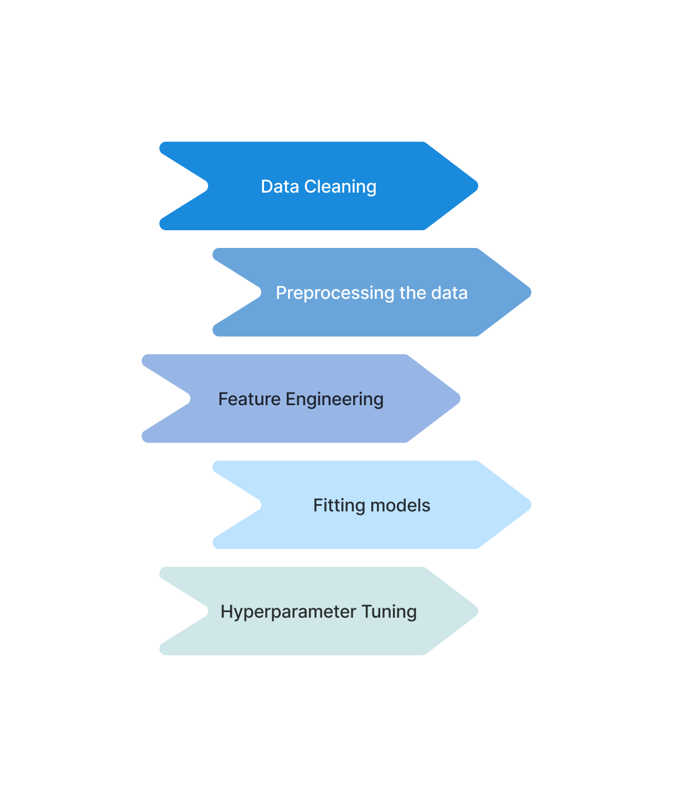

  <h1>Credit Risk Modelling</h1> 
  
Determining the level of credit risk associated with extending credit to a borrower

  <h2>Methodology</h2>
  

  <h2 align = "center">
    Summary
  </h2>  
  

    The dataset contained around 40 variables and thousands of customers.The target variable was <b>Approved Flag</b>.   Chi-square test was performed on categorical variables to check the association with the target variable.  and all the categorical variables were label encoded. 
Three models were used -
   <ul>
  <li>Decision Tree</li>
  <li>Random Forest</li>
  <li>XGBoost</li>
</ul>    
  XGBoost gave the best result as compared to the other two
  To increase the accuracy and improve the model, hyperparameter tuning was performed using <b>grid search method </b>. 
  

